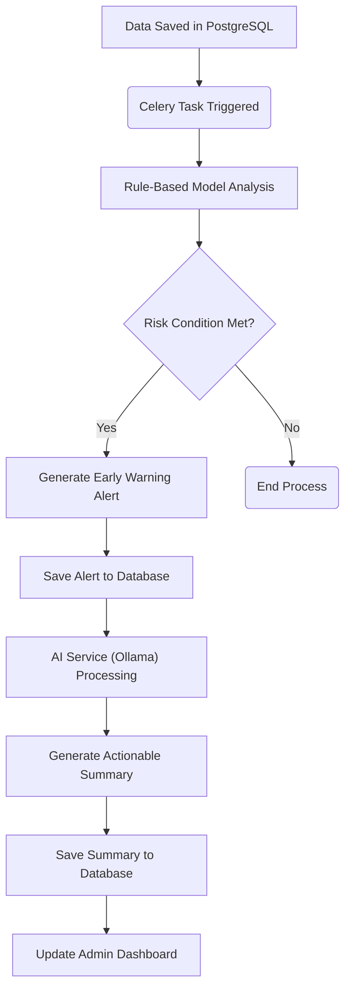

# Software Requirements Specification (SRS) - Project Sentinel

## 1. Introduction

### 1.1 Purpose
This document provides a detailed description of the requirements for **Project Sentinel**, a digital health platform designed to combat water-borne diseases in the rural and tribal belts of the Northeastern Region (NER) of India. Its purpose is to enable early detection, monitoring, and prediction of disease outbreaks to facilitate timely intervention by health authorities.

### 1.2 Document Conventions
This document follows an Agile-friendly format, incorporating User Stories and Mermaid flowcharts to ensure requirements are easily understandable and traceable.

### 1.3 Intended Audience
This SRS is intended for all project stakeholders, including:
*   **Development Team:** Backend, Frontend, Android, and AI/ML engineers.
*   **Project Managers:** For project planning, tracking, and management.
*   **Testers:** To create test cases and plans.
*   **Health Authorities & ASHA Workers:** To understand the system's capabilities and their roles within it.

### 1.4 Project Scope
The project focuses on developing a holistic system that integrates data collection, analysis, and communication to prevent and control water-borne disease outbreaks.

**In-Scope:**
*   An **Android mobile application** for field data collection by ASHA workers.
*   An **SMS/IVR system** for community health reporting.
*   Integration with water quality sensors and manual test kits.
*   An **AI/ML engine** to predict potential outbreaks based on health, environmental, and water quality data.
*   A **real-time alert system** for health officials and community leaders.
*   An **administrative web dashboard** for data visualization and monitoring.

**Out-of-Scope:**
*   Manufacturing of hardware (e.g., water sensors).
*   Providing medical treatment or diagnosis directly to patients.

---

## 2. System Overview

### 2.1 Product Functions
*   **Data Collection:** Gathers data on symptoms, water quality, and environmental factors via a mobile app and SMS/IVR.
*   **Predictive Analysis:** Utilizes AI/ML models to identify high-risk areas and predict potential outbreaks.
*   **Alerting:** Automatically notifies stakeholders (health officials, ASHA workers) about predicted outbreaks or critical water quality levels.
*   **Visualization & Reporting:** Presents data through an intuitive web dashboard with maps, graphs, and reports.

### 2.2 User Roles & Characteristics
1.  **ASHA Workers/Field Health Staff:** Have basic smartphone literacy. Will use the Android mobile app for their daily data entry and to receive alerts. Require an intuitive interface and offline capabilities.
2.  **Health Officials/Administrators (Ministry):** Are tech-savvy and require a comprehensive overview of the health situation. Will use the web dashboard to monitor trends, view hotspots, and make data-driven decisions.
3.  **Community Members:** May have low smartphone penetration and varying literacy levels. Will interact primarily through a simple SMS or IVR-based system to report symptoms.
4.  **NGOs/Clinics:** Contribute ground-level data (e.g., survey data or clinic cases) and interact with the system through specific dashboards.

### 2.3 High-Level Architecture
The system is composed of five main parts: a Data Collection Layer, Data Storage Layer, Processing & ML Layer, Alerting Layer, and a Presentation Layer.

---

## 3. Core Epics & User Stories

### Epic 1: User Management & Authentication

> **EPIC:** To build a role-based authentication system that provides secure access to different users (Admin, ASHA, NGO, Clinic).

*   **User Story 1:** As a **user**, I want to register and log in to the system according to my role.
*   **User Story 2:** As an **admin**, I want to manage all users in the system.

**Authentication Flowchart:**

### Epic 2: Data Collection & Field Reporting

> **EPIC:** To streamline the collection of health, water, and environmental data from the field for ASHA workers and NGOs.

*   **User Story 1:** As an **ASHA worker**, I want to submit health reports (symptoms, severity, etc.) for patients in my village using the Android app, even when offline.
*   **User Story 2:** As an **NGO worker**, I want to submit village surveys (water quality, sanitation) from my web dashboard.

**ASHA Worker Data Submission Flow:**

### Epic 3: AI-Powered Prediction & Alerting

> **EPIC:** To process collected data to predict potential outbreaks and alert officials.

*   **User Story 1:** As the **system**, I want to analyze data daily to calculate a risk score for each village.
*   **User Story 2:** As the **system**, when a risk score exceeds a threshold, I want to use an AI (Ollama) to generate a detailed summary and action plan.
*   **User Story 3:** As the **system**, I want to display high-risk alerts on the health officials' dashboard immediately.

**Alert Generation Flowchart:**

### Epic 4: Admin Dashboard & Visualization

> **EPIC:** To provide admins with a comprehensive web dashboard to monitor, visualize, and act on data.

*   **User Story 1:** As an **Admin**, I want to view a map of all villages with their risk levels (color-coded).
*   **User Story 2:** As an **Admin**, I want to click on any village to see its detailed statistics (e.g., total cases, deaths, symptom distribution).
*   **User Story 3:** As an **Admin**, I want to read AI-generated alert summaries to take immediate, informed action.

---

## 4. Non-Functional Requirements

*   **NFR-01 (Performance):** The system must be optimized for low-bandwidth environments. API responses should be lightweight.
*   **NFR-02 (Security):** All sensitive health data must be encrypted in transit (using TLS) and at rest. Access control must be role-based.
*   **NFR-03 (Scalability):** The architecture must be scalable to support a growing number of villages, users, and data points.
*   **NFR-04 (Usability):** User interfaces, especially for ASHA workers and community members, must be extremely simple and intuitive.
*   **NFR-05 (Offline Capability):** The Android app must function without an active internet connection and auto-sync data when connectivity is restored.
*   **NFR-06 (Multilingual Support):** The system must support English, Hindi, and relevant tribal languages (e.g., Khasi, Bodo).

---

## 5. Technology Stack

| Component                | Technology                                                              |
|--------------------------|-------------------------------------------------------------------------|
| **Backend**              | Django, Django REST Framework, Celery                                   |
| **Frontend (Web)**       | React, Vite, TypeScript, Tailwind CSS, Shadcn/UI, Recharts, Leaflet     |
| **Mobile App (Android)** | React Native, Expo, TypeScript                                          |
| **Database**             | PostgreSQL, PostGIS                                                     |
| **AI/ML & Prediction**   | Python (Pandas, Scikit-learn, XGBoost), Ollama                          |
| **Real-time**            | Supabase (for live sensor data)                                         |
| **Alerting & SMS**       | Twilio API                                                              |
| **External APIs**        | Geolocation/Maps API, Weather API                                       |
