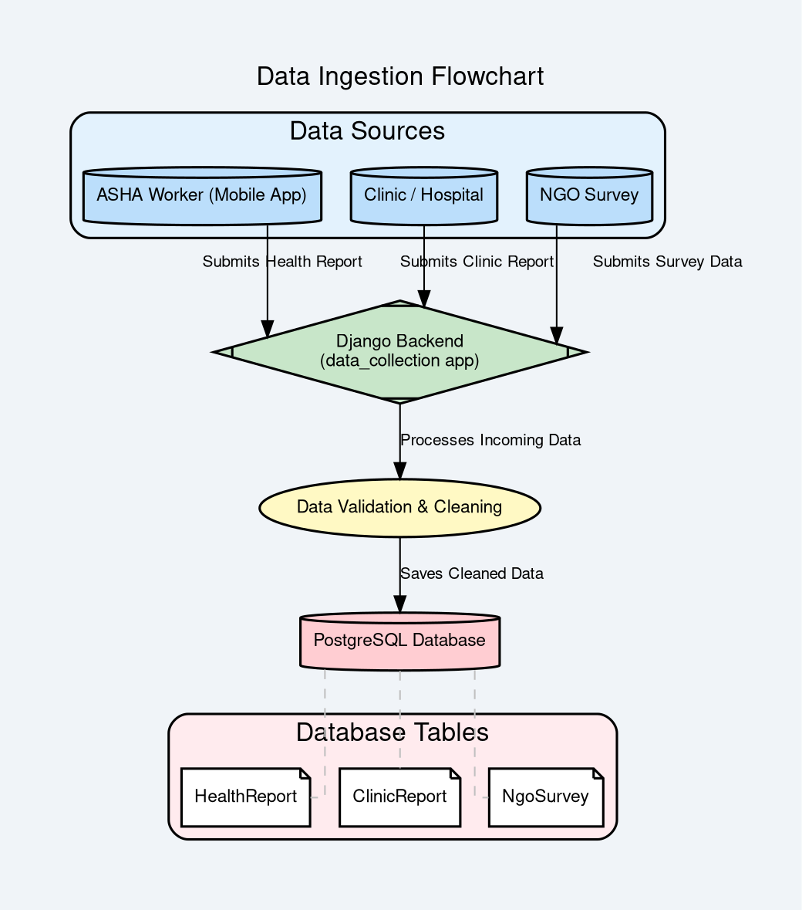
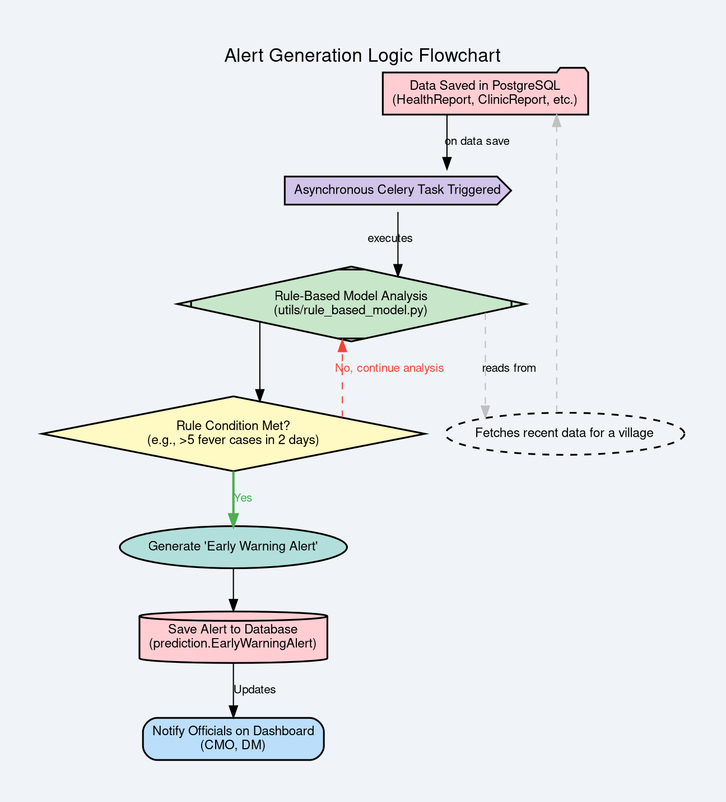

# Backend Flowcharts

This document contains two flowcharts that visualize the core backend processes of Project Sentinel: Data Ingestion and Alert Generation. The diagrams are written in the DOT language and can be rendered using Graphviz.

---

## 1. Data Ingestion Flowchart

This flowchart illustrates how data from various sources (ASHA workers, clinics, NGOs) is collected, processed by the Django backend, and stored in the PostgreSQL database.

---

## 2. Alert Generation Logic Flowchart

This flowchart shows the asynchronous process that begins after data is saved. It details how the rule-based model analyzes the new data, generates an "Early Warning Alert" if specific conditions are met, and notifies officials via the dashboard.

